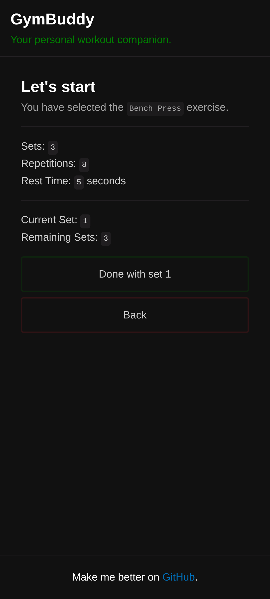
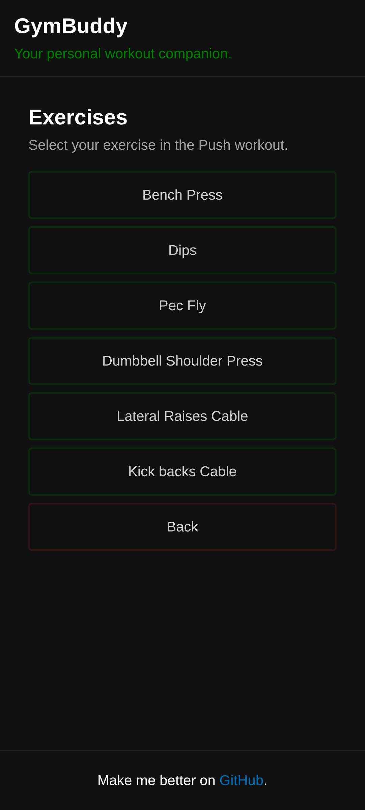

# GymBuddy - Your personal workout companion.

GymBuddy is the first app _(afaik)_ that implements WaC (Workouts As Code). It allows you to define your workouts using a simple Yaml config and display them in a somewhat beatiful way on your phone, because who uses paper anymore?

## Screenshots

|  |  |  |
| ------------------------------------------------------------------------------- | --------------------------------------------------------------------------------- | --------------------------------------------------------------------------- |
| Workout selection                                                               | Exercise selection                                                                | Exercise page                                                               |

## Features

- Define workouts using Yaml
- Track sets, reps and rest times
- Simple and clean UI *subjective*
- Dark mode support *only*

...That's it for now.

## Installation

No Docker image is provided right now, so you have to build it yourself. You will need Go installed on your machine. Then you can clone the repository:

```bash
git clone https://github.com/steveiliop56/gymbuddy
cd gymbuddy
```

Install the dependencies:

```bash
go mod download
```

Finally, build the application:

```bash
go build -o gymbuddy main.go
```

Run the application:

```bash
./gymbuddy
```

## Configuration

GymBuddy uses a Yaml configuration file to define workouts. You can find an example configuration file [here](./config.example.yml) that you can copy and modify to suit your needs. By default, GymBuddy looks for a file named `config.yml` in the same directory as the executable, but you can specify a different path using the `--config-path` flag:

```bash
./gymbuddy -config-path /path/to/your/config.yml
```

Or the environment variable `GYMBUDDY_CONFIG_PATH`:

```bash
export GYMBUDDY_CONFIG_PATH=/path/to/your/config.yml
./gymbuddy
```

## Contributing

Contributions are welcome! If you find a bug or have a feature request, please open an issue. If you'd like to contribute code, feel free to fork the repository and submit a pull request.

## License

GymBuddy is licensed under the MIT License. TL;DR — You can use, copy, modify, merge, publish, distribute, sublicense, and/or sell copies of the software. Just make sure to include the original license in any substantial portions of the code. There’s no warranty — use at your own risk. See the [LICENSE](./LICENSE) file for full details.
